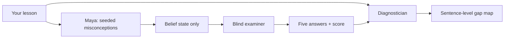

# Protégé

> Every tutor explains things to you. Protégé makes you explain things to it—and then proves whether you understood by testing the student you taught.

Protégé is a learning-by-teaching experience. You teach Maya, a student seeded with specific misconceptions. Her beliefs change only when your explanation provides a real mechanism. When you finish, a separate examiner tests Maya. Her score is your score.

## The key constraint: a blind examiner



The examiner never receives the teaching transcript. That information asymmetry is the heart of the measurement: it grades the model Maya formed, not the wording the teacher used.

## Run locally

```bash
npm install
npm run dev
```

Set `GEMINI_API_KEY` in Vercel or `.env.local`; `GEMINI_MODEL` defaults to `gemini-3.6-flash`. AI Gateway is also supported through `AI_GATEWAY_API_KEY` and `AI_MODEL`. There are no fabricated fallback conversations or scores: provider failures are shown as errors and can be retried.

## What’s included

- 24 misconception-led topics across biology, physics, chemistry, maths, computer science, psychology, earth science, and economics
- Four student personalities
- Live animated mental-model canvas with misconception, shaky, and solid belief states
- Text teaching, browser speech recognition, and speech synthesis
- Blind five-part examination flow
- Sentence-level diagnostic coaching
- Responsive layouts, keyboard controls, reduced-motion support, and resilient voice fallback

## Research foundations

The product direction draws on the learning-by-teaching and misconception literature, including:

- Fiorella & Mayer (2013), *The relative benefits of learning by teaching and teaching expectancy*, Contemporary Educational Psychology.
- Okita & Schwartz (2013), *Learning by teaching human pupils and teachable agents*, Journal of the Learning Sciences.
- Chase et al. (2009), *Teachable agents and the protégé effect*, Journal of Science Education and Technology.
- Wandersee (1983), research on students’ misconceptions about photosynthesis and plant mass.
- Halloun & Hestenes (1985), common-sense concepts about motion.
- Sadler et al. (2013), *The influence of teachers’ knowledge on student learning in middle school physical science classrooms*.

Topic seeds are phrased as learner beliefs rather than claims of universal prevalence. Production expansion should attach a primary citation to every individual seed.

## Architecture direction

The front end is React 18, Vite, TypeScript, Zustand, and Framer Motion. A Vercel serverless function runs the model pipeline, validates every model response with Zod, and passes only the final belief state—not the transcript—to the examiner. The diagnostician receives the transcript only after the blind exam is complete.

## What’s next

- Add the serverless model adapter and strict Zod response schemas
- Expand per-belief primary research citations
- Persist versioned session history in localStorage
- Add automated browser and accessibility regression tests
- Record the exam reveal and include it as a README GIF

MIT licensed.
